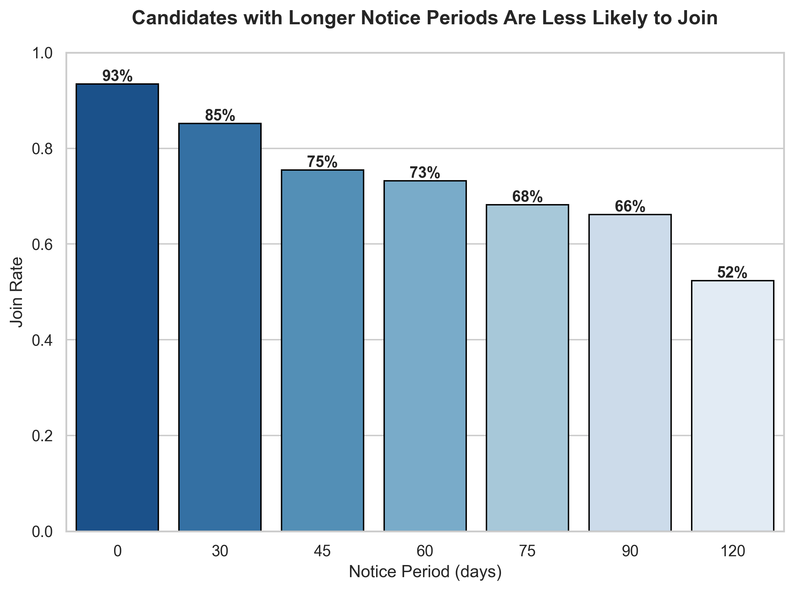
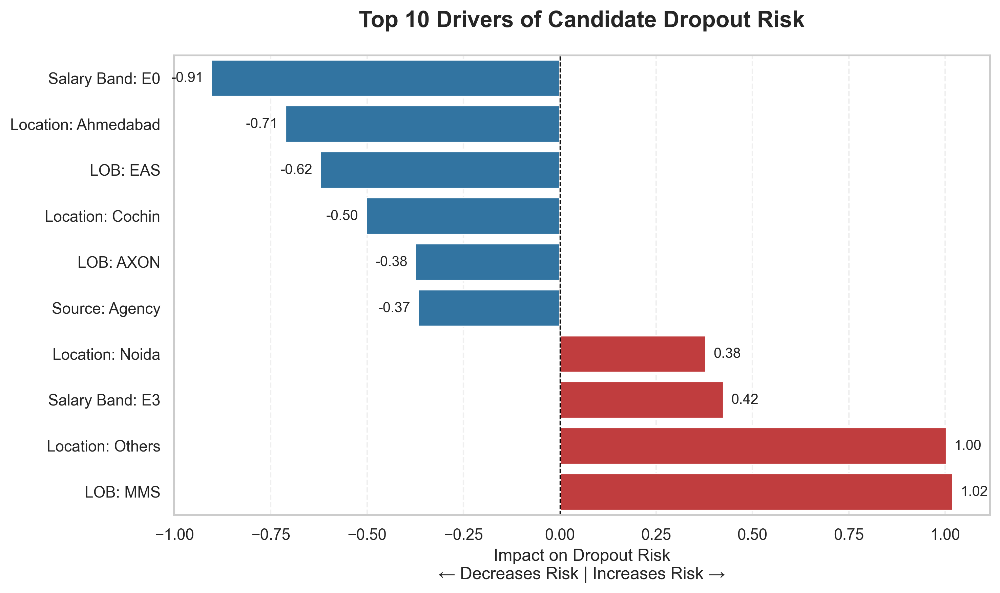

# HR Analytics: Predicting Candidate Dropouts

> Predicting which candidates will renege after accepting offers, enabling early HR intervention.

## 1. Project Overview

In corporate recruitment, the **Offer-to-Join Ratio** is a critical KPI. Candidates who accept offers but fail to join create sunk costs, disrupt hiring pipelines, and delay project timelines by weeks.

This project builds an end-to-end Machine Learning pipeline to predict candidate dropout risk after offer acceptance. The goal is not just prediction, but enabling **early intervention** for high-risk candidates.

---

## 2. Dataset

* **Source:** https://www.kaggle.com/datasets/avikumart/hrdatasetclassif
* **Size:** ~9,000 candidate records
* **Features:** 30+ including demographics, offer details, source channel
* **Target Variable:** `Status` (Joined = 1, Not Joined = 0)
* **Class Distribution:** 81% Joined / 19% Not Joined (Imbalanced)

---

## 3. Key Business Insights (EDA)

1. **Notice Period Impact:** Joining probability decreases significantly as notice period increases.
      * Immediate joiners: ~93% join rate
      * 120-day notice: ~52% join rate
      * *Interpretation:* Longer notice periods increase exposure to competing offers and counter-offers.

2. **Referral Advantage:** Employee referrals show the highest conversion (~88%), outperforming agency candidates.

3. **Hesitation as a Risk Signal:** Candidates taking more than ~3 weeks to accept offers are less likely to join, indicating ongoing offer comparison.

4. **Compensation Overlap:** Salary hike distributions for joiners and non-joiners overlap significantly, suggesting non-monetary factors (engagement, timing) are primary drivers.

---

## 4. Technical Approach

* **Data Leakage Prevention:** Removed post-outcome features (e.g., `Candidate relocate actual`) to ensure the model reflects real-world prediction conditions.

* **Feature Engineering:**
    * `hike_gap`: Offered vs. Expected salary hike
    * `is_fast_joiner`: Notice period ≤ 30 days
    * `is_hesitant`: Offer acceptance time > 21 days

* **Handling Class Imbalance:** Used **Logistic Regression with `class_weight='balanced'`** to prioritize detection of the minority class (Non-Joiners).

---

## 5. Model Performance

| Metric                     | Score | Context                                 |
| :------------------------- | :---- | :-------------------------------------- |
| **Accuracy**               | 63%   | Lower due to class imbalance            |
| **Recall (Non-Joiners)**   | 63%   | ~3.3× better than random baseline (19%) |
| **F1 Score (Non-Joiners)** | 0.39  | Balances precision vs recall            |

### Confusion Matrix

*Test set: Model identified 213 out of 336 actual non-joiners. High recall means we catch 63% of dropouts at the cost of more false alarms.*

---

## 6. Model Explainability (Key Drivers)

| Feature                     | Impact          | Interpretation                                |
| :-------------------------- | :-------------- | :-------------------------------------------- |
| **LOB: MMS**                | Strong Positive | Higher join probability in this business unit |
| **Salary Band: E0**         | Strong Negative | Entry-level band harder to close              |
| **Location: Noida**         | Positive        | Strong regional conversion trends             |
| **Source: Agency**          | Negative        | Lower reliability compared to referrals       |

*Note: These relationships are correlational, not causal, and may reflect underlying business processes.*

---

## 7. Business Interpretation

This model is intentionally optimized for **Recall on Non-Joiners**, not raw accuracy.

* **False Negative (Missed Dropout):** Leads to hiring failure and project delay
* **False Positive (False Alarm):** Leads to minor HR re-engagement effort

**Business Value:**
By identifying nearly **2 out of 3 high-risk candidates**, HR teams can:
* Proactively re-engage candidates
* Adjust offers or timelines
* Prepare backup hires

**Limitation:**
Model performance is constrained by dataset imbalance and lack of temporal features (e.g., market conditions, competing offers).

---

## 8. Tech Stack

* **Language:** Python
* **Libraries:** Pandas, NumPy, Scikit-learn, Matplotlib, Seaborn
* **Baseline Model:** Logistic Regression (`class_weight='balanced'`)

---

## 9. Next Steps

Integrate model outputs into an ATS system to flag candidates with high dropout risk (e.g., probability > 0.7) for proactive HR intervention.

---

**Author:** Dhyan Medappa  
**LinkedIn:** [Add your LinkedIn URL here]  
**Project Type:** End-to-end ML + Business Analytics